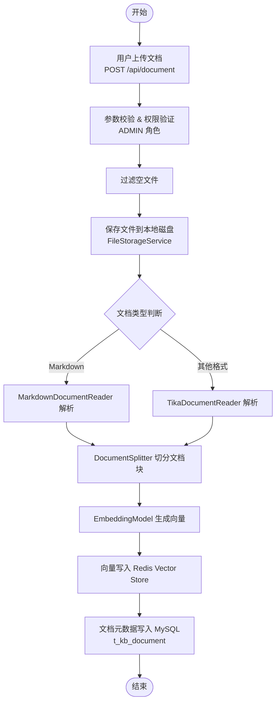
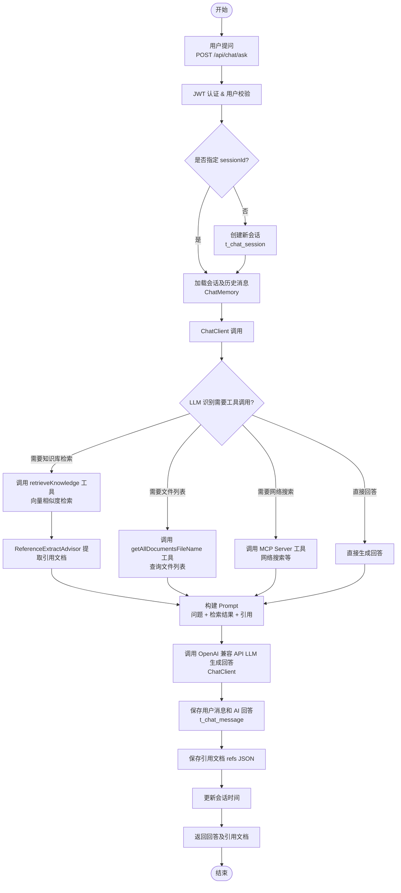
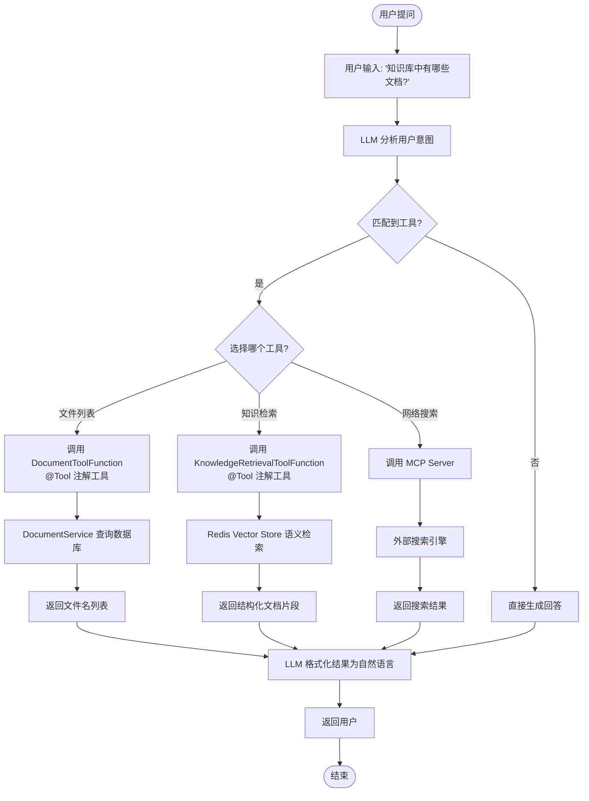
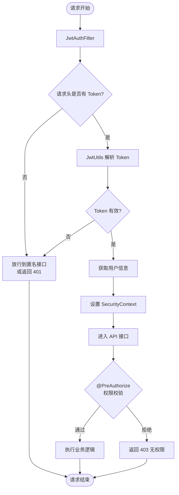

# 架构设计

> **← 返回主文档**：[README.md](../README.md)

## 🏗️ 总体架构图

```mermaid
graph TB
    %% ══════════════════════════════════════
    %% 第一层：客户端
    %% ══════════════════════════════════════
    subgraph Client[客户端]
        Browser[Web 浏览器]
        App[移动 App]
        ThirdParty[第三方系统]
    end

    %% ══════════════════════════════════════
    %% 第二层：接入层
    %% ══════════════════════════════════════
    subgraph Gateway[接入层]
        Nginx[Nginx / 负载均衡]
        CORS[CORS 跨域处理]
    end

    %% ══════════════════════════════════════
    %% 第三层：Spring Boot 应用（独立）
    %% ══════════════════════════════════════
    subgraph Application[Spring Boot 应用 - spring-ai-rag-example-knowledge-database]

        subgraph Security[安全认证层]
            JWTFilter[JWT 认证过滤器]
            SecurityConfig[Spring Security]
        end

        subgraph API[API 接口层]
            AuthApi[认证接口 /api/auth]
            UserApi[用户接口 /api/user]
            CategoryApi[分类接口 /api/category]
            DocumentApi[文档接口 /api/document]
            ChatSessionApi[会话接口 /api/chat/session]
            ChatMessageApi[聊天接口 /api/chat]
            StatsApi[统计接口 /api/stats]
        end

        subgraph Service[业务服务层]
            AuthService[认证服务]
            UserService[用户服务]
            CategoryService[分类服务]
            DocumentService[文档服务]
            FileService[文件存储服务]
            RagIngestService[RAG 摄入服务]
            ChatSessionService[会话服务]
            ChatMessageService[聊天服务]
            StatsService[统计服务]
            LogService[日志服务]
        end

        subgraph Repository[数据访问层]
            UserRepo[用户 Repository]
            CategoryRepo[分类 Repository]
            DocumentRepo[文档 Repository]
            ChatSessionRepo[会话 Repository]
            ChatMessageRepo[消息 Repository]
            LogRepo[日志 Repository]
            StatsRepo[统计 Repository]
        end
    end

    %% ══════════════════════════════════════
    %% 第四层：异步任务层（独立于应用）
    %% ══════════════════════════════════════
    subgraph AsyncTask[异步任务层]
        DelayedTask[延迟任务<br/>虚拟线程异步处理]
    end

    %% ══════════════════════════════════════
    %% 第五层：AI 能力层（独立于应用）
    %% ══════════════════════════════════════
    subgraph AI[AI 能力层]
        ChatClient[ChatClient]
        ReactAgent[ReactAgent<br/>Spring AI Alibaba ReAct]
        ToolFunctions[@Tool 注解工具<br/>知识检索 / 文档查询]
        ChatMemory[ChatMemory<br/>MessageWindowChatMemory]
        CustomAdvisors[自定义 Advisors<br/>日志记录 / 引用提取]
        VectorStoreAdvisor[VectorStoreAdvisor]
        McpClient[MCP Client<br/>SyncMcpToolCallbackProvider]
        EmbeddingModel[EmbeddingModel]
        DocumentSplitter[文档切分器<br/>TokenTextSplitter]
        DocumentReader[文档读取器<br/>Tika / Markdown]
    end

    %% ══════════════════════════════════════
    %% 第六层：数据存储层（最底层）
    %% ══════════════════════════════════════
    subgraph Data[数据存储层]
        McpServer[MCP Server<br/>外部工具服务]
        Ollama[Ollama<br/>Embedding 服务]
        OpenAI[OpenAI 兼容 API<br/>LLM 服务]
        Redis[(Redis<br/>向量数据库 + 缓存)]
        MySQL[(MySQL / MariaDB<br/>关系型数据库)]
        FileSystem[本地文件系统<br/>文档存储]
    end

    %% ────────── 客户端 → 接入层 ──────────
    Browser --> Nginx
    App --> Nginx
    ThirdParty --> Nginx
    Nginx --> CORS
    CORS --> JWTFilter
    SecurityConfig -.-> JWTFilter
    JWTFilter --> API

    %% ────────── API → Service（垂直下行） ──────────
    AuthApi --> AuthService
    UserApi --> UserService
    CategoryApi --> CategoryService
    DocumentApi --> DocumentService
    ChatSessionApi --> ChatSessionService
    ChatMessageApi --> ChatMessageService
    StatsApi --> StatsService

    %% ────────── Service 内部调用 ──────────
    AuthService --> UserService
    DocumentService --> FileService
    DocumentService --> RagIngestService
    ChatMessageService --> ChatSessionService
    StatsService --> UserService
    StatsService --> DocumentService
    StatsService --> ChatMessageService

    %% ────────── Service → Repository（垂直下行） ──────────
    UserService --> UserRepo
    CategoryService --> CategoryRepo
    DocumentService --> DocumentRepo
    ChatSessionService --> ChatSessionRepo
    ChatMessageService --> ChatMessageRepo
    LogService --> LogRepo
    StatsService --> StatsRepo

    %% ────────── Repository → MySQL ──────────
    UserRepo --> MySQL
    CategoryRepo --> MySQL
    DocumentRepo --> MySQL
    ChatSessionRepo --> MySQL
    ChatMessageRepo --> MySQL
    LogRepo --> MySQL
    StatsRepo --> MySQL

    %% ────────── Service → AI 能力层（跨层调用） ──────────
    ChatMessageService --> ChatClient
    RagIngestService --> DocumentReader
    RagIngestService --> DocumentSplitter
    RagIngestService --> EmbeddingModel

    %% ────────── Service → 异步任务层 ──────────
    ChatMessageService --> DelayedTask

    %% ────────── AI 内部调用 ──────────
    ChatClient --> ReactAgent
    ReactAgent --> ToolFunctions
    ChatClient --> ChatMemory
    ChatClient --> CustomAdvisors
    ChatClient --> VectorStoreAdvisor
    ChatClient --> McpClient

    %% ────────── AI → 数据存储层 ──────────
    McpClient --> McpServer
    EmbeddingModel --> Ollama
    ChatClient --> OpenAI
    VectorStoreAdvisor --> Redis

    %% ────────── Service → 数据存储层 ──────────
    FileService --> FileSystem
```

## 📊 分层架构图

```mermaid
graph TD
    subgraph L7[配置层 Config]
        ConfigClasses[配置类<br/>Security / Redis / MyBatis / Web / MCP 等]
        Properties[配置属性类<br/>Rdb / Jwt / File / Cors / McpServer 等]
    end

    subgraph L6[公共层 Common]
        Constants[常量枚举<br/>DatabaseType / FileType / FileCategory / Status / VectorMetaKey]
        Exceptions[异常定义<br/>Base / Service / File / DataSource]
        Utils[工具类<br/>Jwt / Security / DocumentParse / Math / Message / Web]
    end

    subgraph L5[基础层 Base]
        BaseEntity[基础实体 BaseEntity]
        BaseDTO[基础 DTO<br/>BaseDTO / StoredFile]
        BasePO[基础 PO<br/>PageQueryPO]
        BaseVO[基础 VO<br/>Result / MultiResult]
    end

    subgraph L4[领域层 Domain]
        UserDomain[用户领域<br/>entity / dto / po / vo / mapstruct]
        CategoryDomain[分类领域<br/>entity / dto / po / vo / mapstruct]
        DocumentDomain[文档领域<br/>entity / dto / po / vo / mapstruct]
        ChatDomain[聊天领域<br/>session / message]
        LogDomain[日志领域<br/>entity / dto / mapstruct]
        LoginDomain[登录领域<br/>dto / po / vo / mapstruct]
    end

    subgraph L3[数据访问层 Repository]
        UserRepository[AppUserRepository]
        CategoryRepository[CategoryRepository]
        DocumentRepository[DocumentRepository]
        ChatSessionRepository[ChatSessionRepository]
        ChatMessageRepository[ChatMessageRepository]
        SystemLogRepository[SystemLogRepository]
        StatsRepository[StatsRepository]
    end

    subgraph L2[业务服务层 Service]
        AuthService2[AuthService]
        UserService2[AppUserService]
        CustomUserDetails[CustomUserDetailsService]
        CategoryService2[CategoryService]
        DocumentService2[DocumentService]
        FileStorageService[FileStorageService]
        RagIngestService2[RagIngestService]
        ChatSessionService2[ChatSessionService]
        ChatMessageService2[ChatMessageService]
        StatsService2[StatsService]
        SystemLogService[SystemLogService]
        DelayedTaskService2[DelayedTaskService]
        ChatMessageAsyncTask[ChatMessageAsyncTask]
    end

    subgraph L1[接口层 API]
        AuthApi2[AuthApi]
        AppUserApi[AppUserApi]
        CategoryApi2[CategoryApi]
        DocumentApi2[DocumentApi]
        ChatSessionApi2[ChatSessionApi]
        ChatMessageApi2[ChatMessageApi]
        StatsApi2[StatsApi]
    end

    subgraph L0[接入层 Filter / Handle]
        JwtAuthFilter[JwtAuthFilter]
        GlobalExceptionHandler[GlobalWebExceptionHandler]
        MetaObjectHandler[MyBatisPlusMetaObjectHandler]
    end

    L0 --> L1
    L1 --> L2
    L2 --> L3
    L3 --> L4
    L4 --> L5
    L6 --> L2
    L6 --> L3
    L6 --> L4
    L7 --> L0
    L7 --> L2
    L7 --> L3
```



## 🔄 核心流程

### 文档上传与向量化流程



### RAG 问答流程



### 工具调用流程



### 认证与授权流程



---

<div style="display: flex; justify-content: space-between; align-items: center;">
  <span style="color: #888; font-size: 0.9em;">📅 最后更新：2026-07-14</span>
  <a href="#架构设计">⬆️ 返回顶部</a>
</div>
