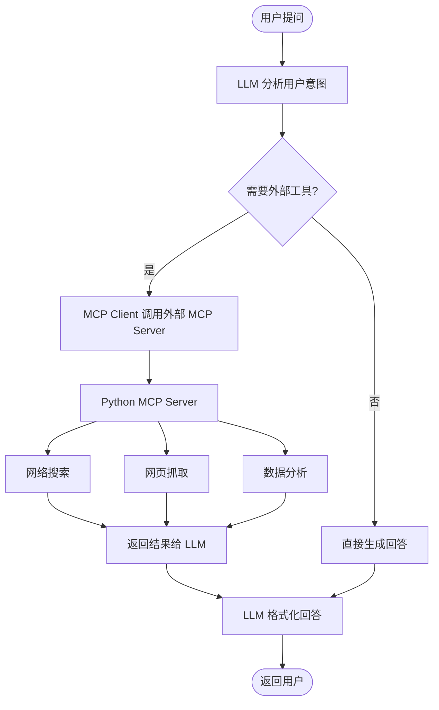

# MCP + Agent + Skills

> **← 返回主文档**：[README.md](../README.md)

本文档说明项目中 MCP（Model Context Protocol）、Agent 和 Skills 三个能力的当前实现状态和后续规划。

---

## 📦 当前实现状态

### 1. MCP（Model Context Protocol）— ✅ 已实现

项目已通过 **Spring AI MCP Client（WebFlux）** 实现了 MCP 协议支持，可以连接外部 MCP Server 来扩展工具能力。

#### 当前架构

- **MCP Client**：通过 `spring-ai-starter-mcp-client-webflux` 依赖实现
- **传输方式**：支持 `streamable-http` 协议
- **外部 MCP Server**：默认配置了 Python MCP Server（`python-mcp-web-search-server`）

#### 配置方式

在 `mcp.yml` 中配置外部 MCP Server 的连接信息：

```yaml
mcp:
  enabled: true
  servers:
    python-mcp-web-search-server:
      url: http://127.0.0.1:8084/mcp
      transport: streamable-http
```

#### 使用方式

1. 启动外部 MCP Server（如 Python MCP Server）
2. Spring Boot 应用启动后，MCP Client 自动连接配置的 MCP Server
3. LLM 在对话中可自动发现并调用 MCP Server 提供的工具

#### Python MCP Server

项目包含一个独立的 Python MCP Server 子项目，提供网络搜索、网页抓取、数据分析等扩展工具能力。详细信息请参考 [Python MCP Server 文档](python-mcp-server.md)。

---

### 2. Agent Framework — 🔲 预留模块

项目已引入 **Spring AI Alibaba Agent Framework** 依赖（`spring-ai-alibaba-agent-framework`），但尚未在代码中使用。

#### 当前状态

- Maven 依赖已配置（`spring-ai-alibaba-agent-framework`、`spring-ai-alibaba-graph-core`）
- `spring-ai-rag-starter-agent` 模块目前仅包含自定义 Advisor（日志记录、引用提取），不包含 Agent 编排逻辑
- 当前的工具调用通过 Spring AI 原生的 Function Calling 机制实现

#### 后续规划

- 集成 Spring AI Alibaba Agent Framework，实现更复杂的 Agent 工作流
- 支持多步骤推理、自主工具链调用
- 支持 Agent 间的协作与编排

---

### 3. Skills 执行引擎 — 🔲 预留模块

`spring-ai-rag-starter-skill` 模块已创建 Maven 目录结构，但暂未实现具体代码。

#### 后续规划

- 实现技能注册与自动发现机制
- 支持技能的同步/异步执行、批量执行、链式执行
- 提供技能市场/仓库的扩展能力

---

## 🔧 MCP 工具调用流程



---

## 📝 配置说明

### MCP Client 配置（mcp.yml）

```yaml
mcp:
  enabled: true                           # 是否启用 MCP Client
  servers:
    python-mcp-web-search-server:
      url: http://127.0.0.1:8084/mcp
      transport: streamable-http
```

### 环境变量

| 环境变量            | 说明                             |
|-----------------|--------------------------------|
| `MCP_TRANSPORT` | MCP 传输方式（默认 `streamable-http`） |

---

## ⚠️ 注意事项

1. **MCP Server 需先启动**：在使用 MCP 工具前，需要先启动外部 MCP Server（如 Python MCP Server）
2. **网络连通性**：确保 Java 应用能够访问 MCP Server 的 URL
3. **工具发现**：MCP Server 提供的工具会被 Spring AI 自动发现并注册为可用的 Function Callback
4. **预留模块**：Agent Framework 和 Skills 模块为预留模块，当前不影响系统正常运行

---

## 🔮 后续演进路线

### 第二阶段
1. 集成 Spring AI Alibaba Agent Framework，实现 Agent 自主编排
2. 完善 MCP 管理层，支持多 MCP Server 注册、健康检查、故障转移
3. 添加更多 Python MCP Server 工具（图表生成、报告生成等）

### 第三阶段
1. 实现 Skills 执行引擎，支持技能注册和编排
2. 实现完整的 Agent 工作流引擎
3. 支持分布式 MCP Server 集群

---

<div style="display: flex; justify-content: space-between; align-items: center;">
  <span style="color: #888; font-size: 0.9em;">📅 最后更新：2026-07-14</span>
  <a href="#mcp--agent--skills">⬆️ 返回顶部</a>
</div>
